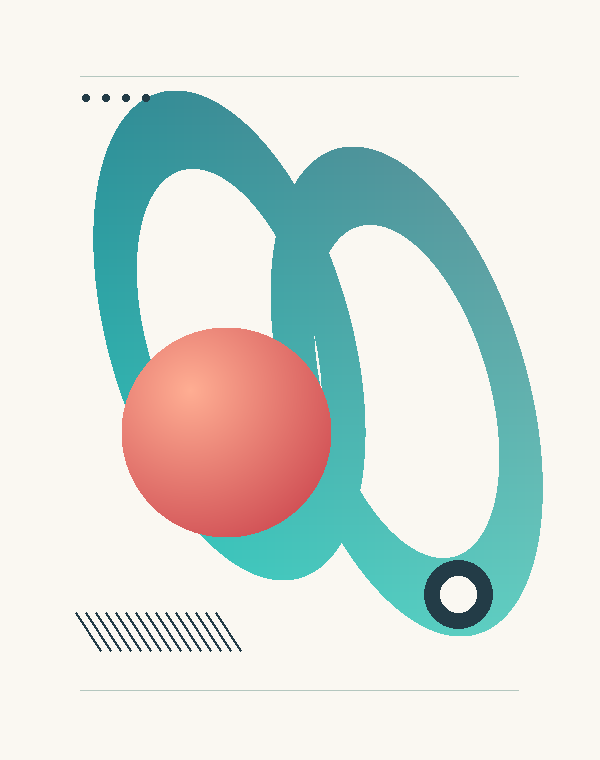

<div align="center">

# Sketchforge

[](https://github.com/qiguai2233/sketchforge/releases)
[](https://github.com/qiguai2233/sketchforge/actions)
[](https://www.python.org/)
[](#输出约束)
[](LICENSE)

**把参考图片描摹成可直接打开的纯 HTML + CSS / SVG 单文件插画。**

[GitHub](https://github.com/qiguai2233/sketchforge) · [下载](https://github.com/qiguai2233/sketchforge/releases)

</div>

Sketchforge 是一个**离线图像转矢量插画工具**：输入一张本地照片 / 插画 / 截图，在本地完成颜色分区、轮廓提取与渐变拟合，输出一张**单文件、零外部依赖**的 HTML 插画。成品无需 Python、图片文件或网络连接即可直接用浏览器打开。

项目同时提供 `css` 与 `svg` 两种输出方言，并附带可独立安装的 Agent 技能（Skill）与命令行工具，任何能加载 Agent Skills 并执行本地命令的 AI 编程助手（Codex、Claude Code 等）都可直接使用。

转换属于**有损的自动轮廓描摹**。生成的图层按颜色与轮廓组织，不会把人物自动拆成可语义编辑的头发、眼睛或服装组件。

## 面向用户

### 能做什么

- 将插画、色块图和其他静态位图转换为单文件 HTML（纯 CSS 多边形 / clip-path，或内联 SVG 路径）。
- `svg` 方言支持 Catmull-Rom 贝塞尔平滑，还原"手绘"质感；形状按颜色语义分组，可编辑。
- 在较大色块内拟合局部渐变，并用内层底色（underpainting）改善缩小显示时的接缝。
- 提供 `preview`、`balanced`、`faithful` 三档精度；`--fit 20` 按目标体积自动降档适配。
- 在 Oklab 感知色彩空间做中位切分量化，色带与细节丢失更少，同档体积更小。
- 用 `--score` 离线栅格化评分，在报告中量化成品与参考图的差异（MAE）。
- 支持中文路径、EXIF 方向、透明图片的背景合成和 JSON 转换报告。
- 自动检查成品的 HTML/CSS 结构约束，禁止 ``、SVG、Canvas、JavaScript、base64 与外链资源。

### 示例

<div align="center">

</div>

上图是仓库自制的**输入测试图**；对应的 [纯 CSS 成品](docs/contour-study.html) 与 [SVG 成品](docs/contour-study-svg.html) 下载后可直接打开。README 中的图片仅用于说明，生成的 HTML 不引用它。

### 下载 v0.2.1

| 文件 | 说明 |
| --- | --- |
| [sketchforge-0.2.1-plugin.zip](https://github.com/qiguai2233/sketchforge/releases/download/v0.2.1/sketchforge-0.2.1-plugin.zip) | 完整插件源包，含清单、Skill、CLI、文档、示例和测试 |
| [sketchforge-0.2.1-skill.zip](https://github.com/qiguai2233/sketchforge/releases/download/v0.2.1/sketchforge-0.2.1-skill.zip) | 可单独安装的 Skill，已包含转换脚本与许可证 |
| [SHA256SUMS.txt](https://github.com/qiguai2233/sketchforge/releases/download/v0.2.1/SHA256SUMS.txt) | 两个压缩包的 SHA-256 校验值 |

### 系统要求

- 生成时：Python 3.10+，NumPy、Pillow、OpenCV；首次安装依赖需要网络。
- 查看时：支持 CSS 多边形偶奇填充、渐变和 `aspect-ratio` 的浏览器。

### 在 AI Agent 中使用

任何支持 Agent Skills 格式的 AI 编程助手都能加载本技能：下载并解压 Skill 包，把 `sketchforge` 整个目录放进个人 `~/.agents/skills/`，或项目的 `.agents/skills/`，然后用自然语言让 Agent 调用即可。

安装后提供参考图片并输入：

```text
$sketchforge 将这张参考图尽可能准确地复刻为纯 HTML + CSS 单文件。
禁止 img、SVG、Canvas、JavaScript、base64 和外部资源。
使用 faithful 精度，检查桌面与窄屏效果，然后交付 HTML。
```

完整插件的清单位于 `.codex-plugin/plugin.json`。

### 直接使用命令行

在仓库根目录执行以下命令：

```bash
python -m venv .venv
.venv/bin/python -m pip install -r skills/sketchforge/requirements.txt
.venv/bin/python skills/sketchforge/scripts/image_to_css.py convert "参考.png" -o "插画.html" --preset faithful
.venv/bin/python skills/sketchforge/scripts/image_to_css.py audit "插画.html"
```

Windows 使用 `.venv\Scripts\python.exe`。转换完成后直接在浏览器打开 HTML。

常用参数：

| 参数 | 用途 |
| --- | --- |
| `--preset preview/balanced/faithful` | 速度、体积与细节之间的取舍，默认 faithful |
| `--max-width 1200` | 限制描摹宽度；最长边也限制为该值的两倍 |
| `--colors 160` | 量化颜色数，范围 2–256 |
| `--background '#faf8f2'` | 指定页面底色与透明区域的合成色 |
| `--title "画面描述"` | 设置标题及无障碍描述，按纯文本转义 |
| `--max-output-mb 32` | HTML 体积预算，单位 MiB，默认 64 |
| `--fit 20` | 目标体积（MiB）：自动逐档降低宽度/颜色直到装得下 |
| `--report .work/report.json` | 写入轮廓数、渐变数、依赖版本及 SHA-256 |
| `--no-gradients` / `--no-underpainting` | 关闭局部渐变 / 防接缝底色 |
| `--score` | 离线栅格化并与参考图对比，在报告中写入 MAE 差异度 |
| `--force` | 明确覆盖已有输出与报告 |

### 输出约束

成品由 `main`、`div`、内联样式和必要的文档元信息组成。所有可见图形来自 CSS 多边形/渐变或内联 SVG 路径，不包含 ``、SVG、Canvas、JavaScript、外链、字体资源或 base64。Python 仅用于离线制作。

### 已知限制

高精度成品可能达到数十 MB、数万个元素，低内存设备上的渲染开销较高。照片、纹理与噪点比色块清晰的插画更容易产生大文件。透明背景会被合成到指定底色；动画和多页图片需要先导出单帧。宽色域或 CMYK 来源建议先转成 sRGB。

自动审计只能验证结构，不能证明相似度；仍应对照参考图查看细线、轮廓、渐变和不同显示尺寸。完整算法与调参说明见 [tuning.md](skills/sketchforge/references/tuning.md)。

---

## 面向开发者

### 设计原则

转换算法与模型分离：Skill 负责选参数、调用工具和视觉检查，Python 负责可重复的图形处理。相同输入、参数和依赖环境生成相同 HTML；报告另行记录耗时。所有运行资源都放在 Skill 内，单独复制 Skill 后仍可使用。

### 目录结构

```text
.codex-plugin/plugin.json              # 插件清单
skills/sketchforge/
├── SKILL.md                           # 工作流程与触发条件
├── agents/openai.yaml                 # 展示信息
├── requirements.txt                   # 制作阶段依赖
├── scripts/image_to_css.py            # CLI 入口
├── scripts/css_art/                   # 分区、几何、渐变、输出与审计
└── references/tuning.md               # 调参与边界
scripts/                              # 检查、打包和原创测试图生成
tests/                                # 回归测试
docs/                                 # 可公开的输入样例及 HTML 成品
.github/workflows/ci.yml               # 跨平台检查
```

### 检查与打包

```bash
.venv/bin/python scripts/check.py
.venv/bin/python scripts/package.py
```

压缩包输出到 `dist/`，仅收录明确列出的源码与文档目录，使用固定 ZIP 元数据以便重复构建。`.venv/`、`.work/` 和用户输入不会打包。不要将私有参考图、生成结果或本机路径提交到仓库。

### 参与开发与许可证

欢迎通过 Issue 提供可公开的最小复现图片、命令、依赖版本和浏览器信息。算法改动请补充对应回归并对照检查生成效果。

代码与仓库自制测试图采用 [MIT](LICENSE)，Copyright (c) 2026 qiguai2233。第三方依赖遵循各自许可证；输入图片与派生内容的权利不因使用本工具而改变。